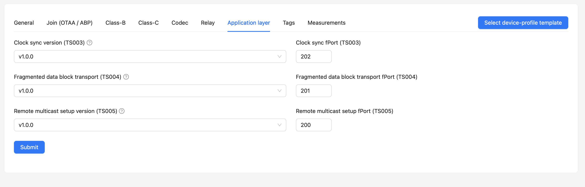
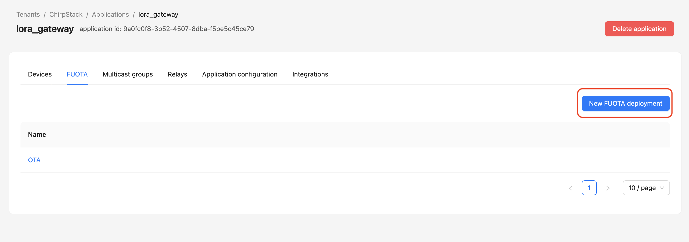
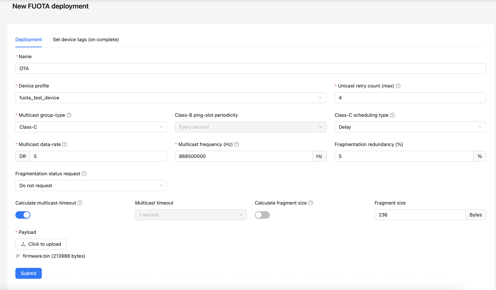
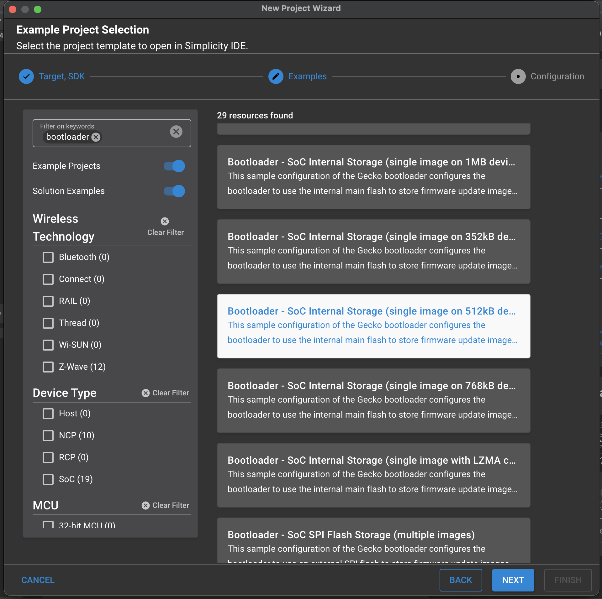
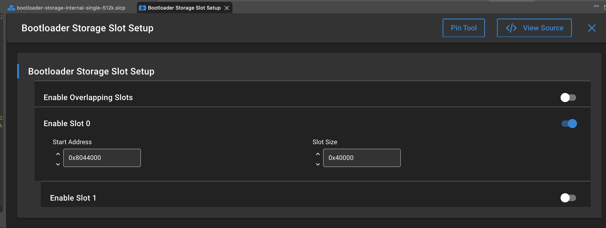
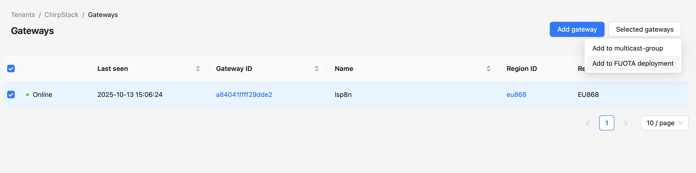
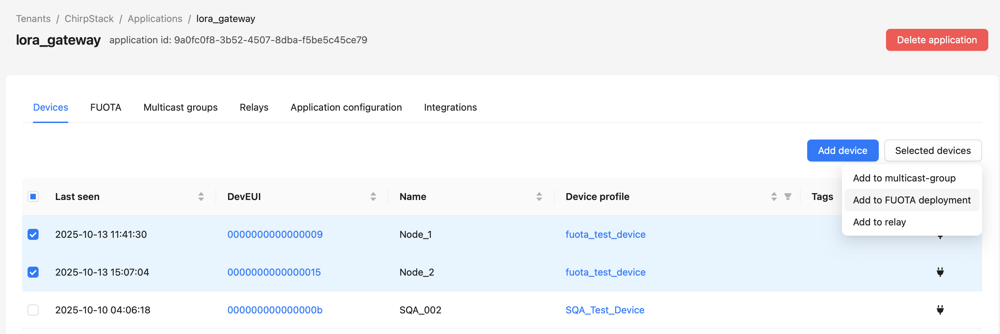
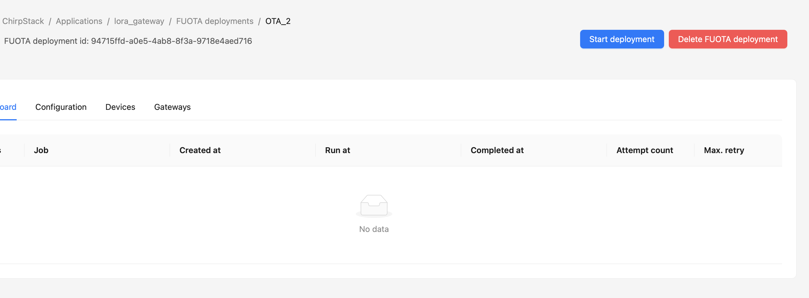
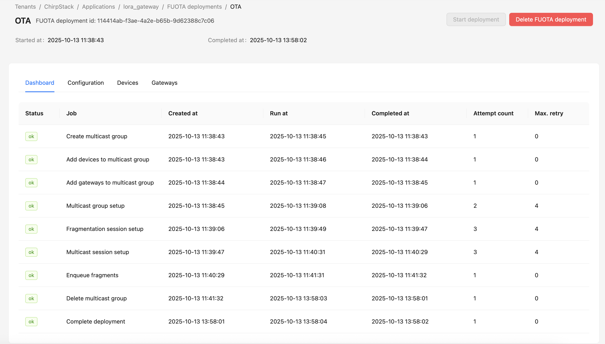

# FUOTA feature

This example demonstrates LoRaWAN FUOTA (Firmware Update Over The Air) on Silicon Labs EFR32 with LoRa Basics Modem and SX1262. FUOTA is enabled on top of the periodical uplink application.

## Overview

FUOTA lets you deploy firmware over the LoRaWAN network without physical access. The stack uses LoRa Alliance application-layer packages (multicast setup, fragmentation, clock sync) plus the Silicon Labs bootloader for install/rollback.

### Key components

1. **Multicast groups** — devices join a group for efficient fragment broadcast (Class C)
2. **Fragmentation** — firmware split into numbered fragments; missing ones recovered via uplink
3. **Clock synchronization** — Application Layer Clock Sync for scheduled reception
4. **Bootloader** — validates and installs a Silicon Labs `.gbl` image

### Process flow

1. Upload firmware on the network server
2. Configure multicast / clock sync on the device
3. Broadcast fragments; recover missing ones
4. Verify image; bootloader installs and reboots
5. Device confirms update

## Requirements

See [Hardware](../README.md#hardware) and [Software requirements](../README.md#software-requirements) in the EFR32 porting README.

Also needed for this example:

- LoRaWAN gateway and network server, USB for programming/debug
- Simplicity Commander (for `.gbl` creation / flashing)
- Compatible bootloader firmware on the device

## Features

- LoRaWAN 1.0.4 OTAA
- Periodical uplink (port 101) and button uplink (port 102)
- FUOTA packages when `ALLOW_FUOTA=yes`

## Configuration

### Timing

- **Periodic uplink**: 10 s (`PERIODICAL_UPLINK_DELAY_S`)
- **First message after join**: 10 s (`DELAY_FIRST_MSG_AFTER_JOIN`)

### Credentials and region

In [example_options.h](example_options.h):

- `USER_LORAWAN_DEVICE_EUI`
- `USER_LORAWAN_JOIN_EUI`
- `USER_LORAWAN_GEN_APP_KEY`
- `USER_LORAWAN_APP_KEY`
- `MODEM_EXAMPLE_REGION` (default EU_868)

### FUOTA build options

In [app_makefiles/app_options.mk](../app_makefiles/app_options.mk) (or on the `make` command line):

```makefile
ALLOW_FUOTA ?= yes
FUOTA_VERSION ?= 1
FUOTA_MAXIMUM_NB_OF_FRAGMENTS ?= 1500
FUOTA_MAXIMUM_SIZE_OF_FRAGMENTS ?= 242
FUOTA_MAXIMUM_FRAG_REDUNDANCY ?= 100
```

Enabling FUOTA increases RAM usage (read-modify-write).

## Prerequisites

### 1. Gateway and network server

- Gateway example: Dragino LPS8N
- Network server example: ChirpStack v4

### 2. Provision the device

Add DevEUI, JoinEUI, GenAppKey, and AppKey on the server.

Configure the ChirpStack **device profile** for LoRaWAN FUOTA (Class C / multicast as required). Application-layer package version must match `FUOTA_VERSION`.



### 3. Create a FUOTA deployment

In Application → FUOTA, create a new deployment.



Typical parameters:



- **Unicast retry counter (max)**: retries when setting up the multicast group
- **Multicast data-rate**: e.g. DR5 for max fragment size in EU868
- **Multicast frequency (Hz)**: frequency allowed in the region
- **Fragment size**: for EU868, max useful size is typically **236 bytes** (242 − MAC/index overhead, multiple of 4)
- **Payload**: Silicon Labs bootloader expects a **`.gbl`** file:

```bash
commander gbl create <gbl_file_name>.gbl --app <application_file_name>
```

### 4. Create a bootloader

In Simplicity Studio, create a **512 kB Bootloader - SoC Internal Storage** project.



Increase storage if needed (example: **256 kB / 0x40000** instead of the default ~196 kB) so the application image fits.



Flash the bootloader before the application.

## How to Use

### 1. Enable FUOTA and set credentials

Primary path in this SWL2001 tree: makefile / `app_options.mk`:

```makefile
ALLOW_FUOTA = yes
```

Set credentials in [example_options.h](example_options.h).

### 2. Build and flash

From `lbm_applications/4_porting_efr32`:

```bash
make sx1262 BOARD=brd4405a MODEM_APP=PERIODICAL_UPLINK ALLOW_FUOTA=yes
```

Output: `build_sx1262_<board>/app_sx1262.hex`

Flash bootloader, then application.

### 3. Add device and gateway to the FUOTA deployment





### 4. Run the deployment

Start FUOTA on ChirpStack and monitor the dashboard.





The end-device receives MAC commands to set up a Class C multicast group. Firmware fragments are printed on the debug console as they arrive.

## Troubleshooting

### Deployment fails to start

- Device supports Class C
- Multicast frequency / data rate valid for the region
- Fragment size appropriate (max 236 bytes for EU868 in the example above)
- Payload is a valid `.gbl`

```bash
commander gbl create firmware.gbl --app application.hex
```

### Clock sync issues

- Gateway time (GPS/NTP)
- Network server clock-sync support
- Device handling of clock-sync MAC commands

### Network issues during FUOTA

- Duty cycle and fragment ACK timing
- Multicast downlink processing
- Gateway capacity under multicast load

### Performance

- Prefer max supported multicast DR and efficient fragment size
- Smaller device groups reduce congestion
- On high loss: improve RF conditions or lower multicast DR
