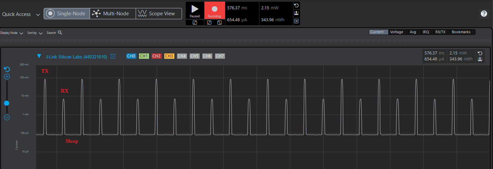

# Ping Pong Example

Basic LoRa ping-pong between two devices (no gateway) using LoRa Basics Modem radio access on Silicon Labs EFR32 + SX1262.

## Overview

- **Ping**: sends `PING`
- **Pong**: replies with `PONG`
- Modulation parameters are fixed in `main_ping_pong.c`

## Radio parameters

| Parameter | Value |
|---|---|
| Sync word | `0x34` (LoRaWAN public) |
| Frequency | 868.1 MHz |
| TX power | 14 dBm |
| Bandwidth | **250 kHz** (`RAL_LORA_BW_250_KHZ`) |
| Spreading factor | SF7 |
| Coding rate | 4/5 |
| Preamble | 12 symbols |
| Header | Implicit |
| CRC | On |
| IQ | Not inverted |

## Requirements

See [Hardware](../README.md#hardware) and [Software requirements](../README.md#software-requirements) in the EFR32 porting README.

This example needs **two** boards of a supported type (same frequency). Role selection:

| Board | Role selection |
|---|---|
| `brd4405a` / `brd4400c` / `brd4187c` | Runtime: **BTN0** = PING, **BTN1** = PONG |
| `xiao_mg24` | Build-time: `PING_PONG_ROLE=PING` or `PONG` |

Optional: Energy Profiler to measure power.

## How to Use

### Build

From `lbm_applications/4_porting_efr32`:

**Pro Kit / BRD4405A** (one image; role chosen at runtime):

```bash
make sx1262 BOARD=brd4405a MODEM_APP=PING_PONG
```

Also valid: `BOARD=brd4400c` or `BOARD=brd4187c`.

**XIAO MG24** (two images; role fixed at build):

```bash
make sx1262 BOARD=xiao_mg24 MODEM_APP=PING_PONG PING_PONG_ROLE=PING
make clean_all
make sx1262 BOARD=xiao_mg24 MODEM_APP=PING_PONG PING_PONG_ROLE=PONG
```

Firmware: `build_sx1262_<board>/app_sx1262.hex`

### Flash

- `xiao_mg24`: flash PING image to one board, PONG image to the other
- Other boards: flash the same image to both boards

### Start

**xiao_mg24** — starts automatically after reset:

```text
[D] INFO: LoraWAN Ping Pong without Gateway Example
[D] INFO: Ping device
[D] INFO: Ping device selected
```

```text
[D] INFO: LoraWAN Ping Pong without Gateway Example
[D] INFO: Pong device
[D] INFO: Pong device selected
```

**brd4405a / brd4400c / brd4187c** — wait for button:

- Press **BTN0** for Ping
- Press **BTN1** for Pong

### Observe

Ping:

```text
[D] INFO: Ping device selected
[D] INFO: TX Done!
[D] INFO: Received message: PONG
```

Pong:

```text
[D] INFO: Pong device selected
[D] INFO: Received message: PING
[D] INFO: TX Done!
```

## Power Management

The example uses radio sleep and MCU EM2 between TX/RX events so current can be profiled.

### Low power features

- Radio sleeps after each TX/RX
- MCU uses EM2 when idle

### Measuring power

Use Energy Profiler (or equivalent). After flashing, **reset the kit** so the MCU and radio enter proper sleep states.



Typical average currents (reference):

- Sleep: ~85 μA
- TX: ~85 mA
- RX: ~8 mA

## Troubleshooting

- Flash matching roles / same radio parameters on both devices
- Confirm antennas and 868.1 MHz regulatory constraints
- Use the debug console for TX/RX and CRC errors
