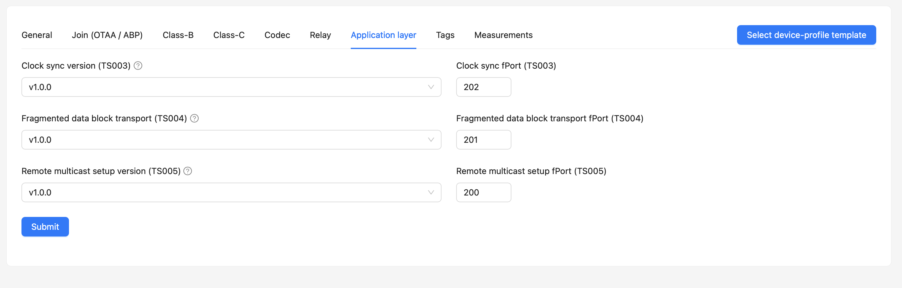
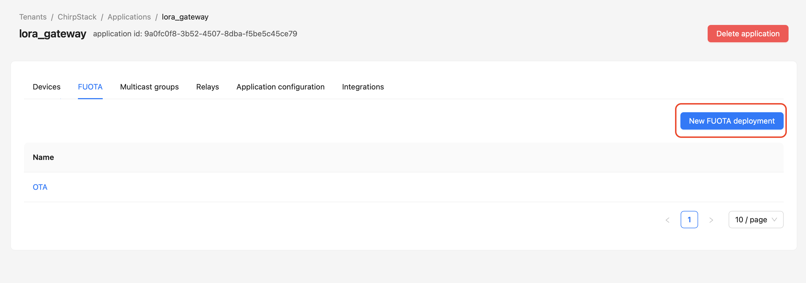
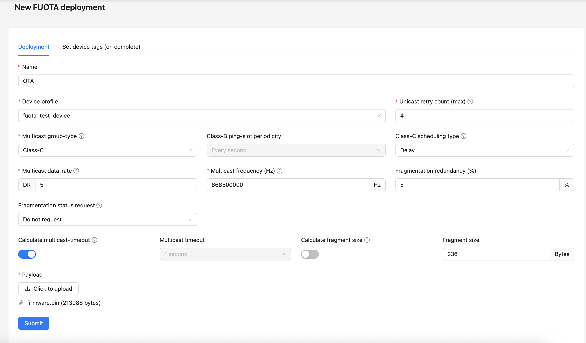
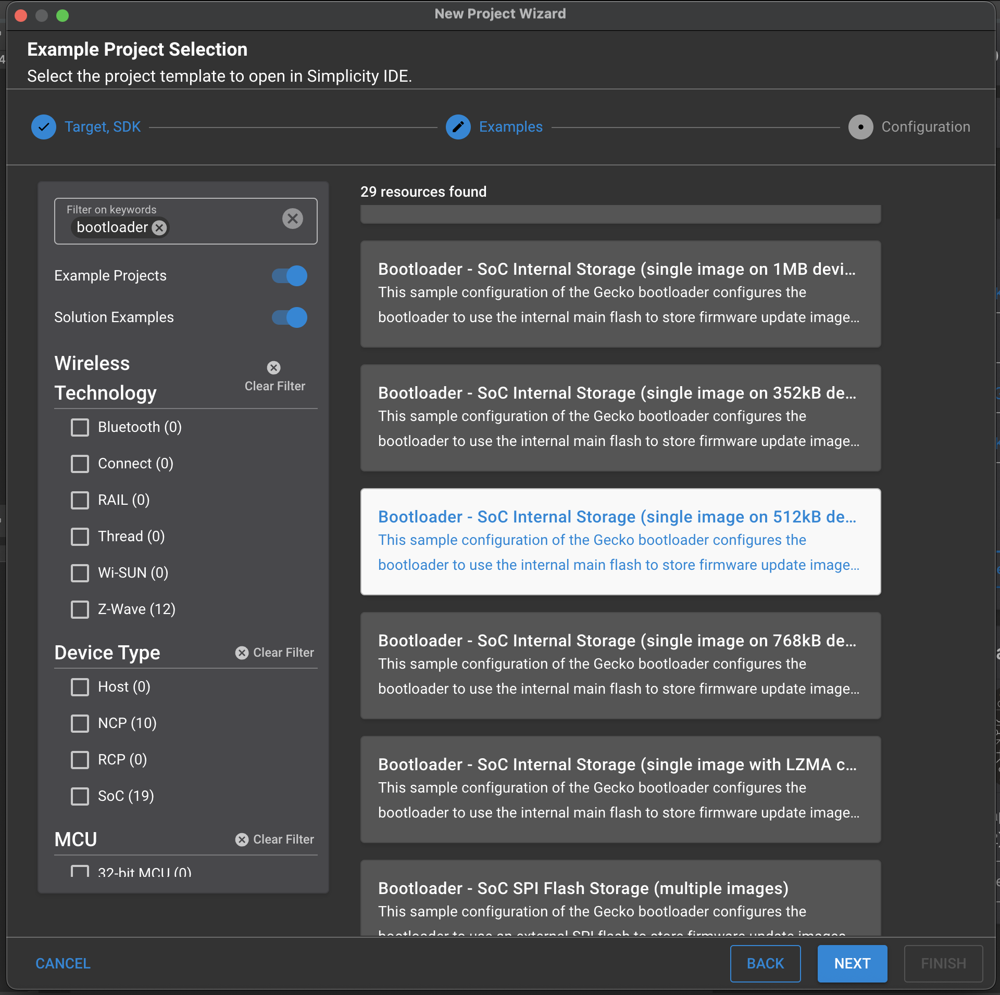
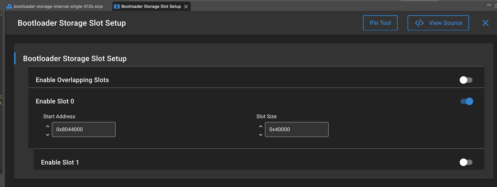
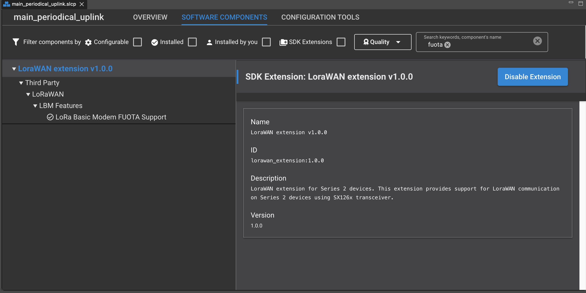
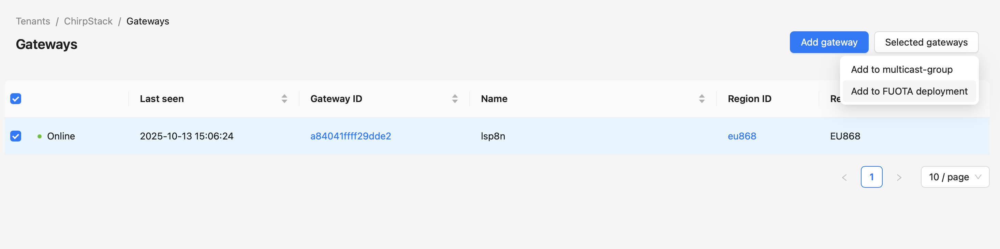
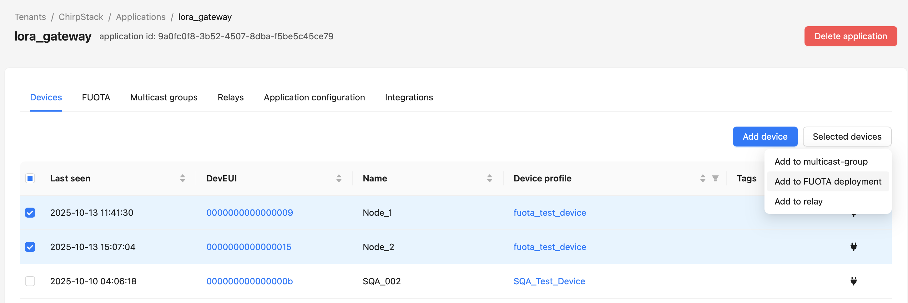
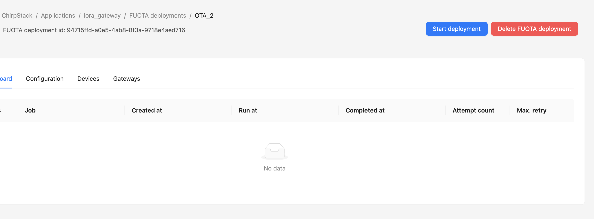
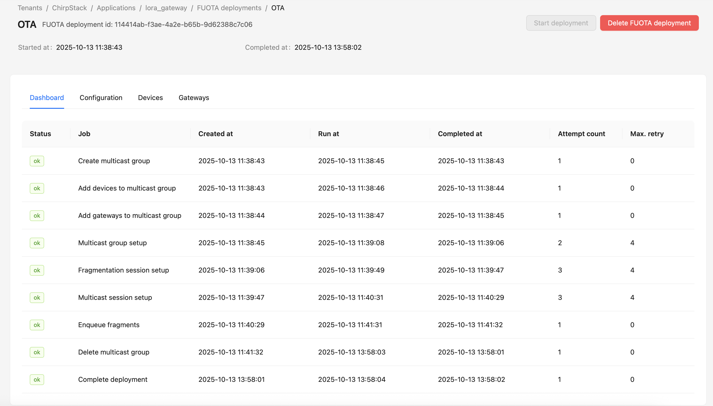

# FUOTA feature

This example demonstrates a LoRaWAN end-device implementation with **FUOTA (Firmware Update Over The Air)** capability, enabling remote firmware updates through the LoRaWAN network. The implementation combines the Semtech LoRaWAN Basic Modem library with Silicon Labs Simplicity SDK to provide a complete FUOTA-enabled IoT device solution that supports both regular LoRaWAN communication and wireless firmware deployment.

## Overview

FUOTA (Firmware Update Over The Air) is a critical feature for LoRaWAN IoT deployments that enables secure, remote firmware updates without requiring physical access to devices. This example implementation demonstrates how to integrate FUOTA capabilities into Silicon Labs EFR32 devices using the Semtech LoRaWAN Basic Modem library.

#### Key FUOTA Components

**1. Multicast Groups**
- Devices join multicast groups to receive firmware fragments efficiently
- Reduces network congestion by broadcasting updates to multiple devices simultaneously
- Supports Class C operation modes for scheduled or continuous reception

**2. Fragmentation Protocol**
- Large firmware images are split into small fragments suitable for LoRaWAN transmission
- Each fragment is numbered and transmitted with error detection capabilities
- Missing fragments are automatically requested through uplink messages

**3. Clock Synchronization**
- Ensures devices receive multicast transmissions at the correct time
- Uses LoRaWAN Application Layer Clock Synchronization service

**4. Bootloader Integration**
- Seamless integration with Silicon Labs bootloader for secure firmware installation
- Validates firmware integrity before installation using cryptographic signatures
- Provides rollback capability in case of update failures

#### FUOTA Process Flow

1. **Network Server Preparation**: Administrator uploads new firmware to the LoRaWAN network server
2. **Device Discovery**: Network server identifies target devices for the update
3. **Multicast Setup**: Devices are configured to join appropriate multicast groups
4. **Clock Sync**: Devices synchronize their clocks with the network server
5. **Fragment Transmission**: Firmware fragments are broadcast via multicast downlinks
6. **Fragment Recovery**: Devices request missing fragments through unicast uplinks
7. **Integrity Verification**: Complete firmware image is validated using checksums/signatures
8. **Installation**: Bootloader installs the new firmware and reboots the device
9. **Confirmation**: Device reports successful update back to the network server

## Requirements

### Hardware
- Silicon Labs WSTK BRD4002A.
- Silicon Labs EFR32xG28 radio board.
- Semtech SX1262 evaluation board.
- Silicon Labs BRD8042A adapter board.
- LoRaWAN Gateway and Network Server.
- USB cable for programming and debug.

### Software
- Silicon Labs Simplicity SDK 2025.6.0.
- Silicon Labs Simplicity Commander tool.
- LoRaWAN extension.
- Bootloader firmware.

## Features
- **LoRaWAN 1.0.4 Compliance**: Full LoRaWAN stack implementation.
- **OTAA Join Procedure**: Secure network joining with DevEUI, JoinEUI, and AppKey.
- **Dual Uplink Ports**:
  - Port 101: Periodic automatic uplinks.
  - Port 102: Manual button-triggered uplinks.
- **Downlink Reception**: Processes received downlink data and metadata.
- **Debug Tracing**: Comprehensive debug output via console.

## Configuration Parameters

### Timing Configuration
- **Periodic Uplink Interval**: 10 seconds (configurable via `PERIODICAL_UPLINK_DELAY_S`)
- **First Message Delay**: 10 seconds after join (configurable via `DELAY_FIRST_MSG_AFTER_JOIN`)
- **Watchdog Reload Period**: 20 seconds

### LoRaWAN Credentials
Configure in `example_options.h`:
- `USER_LORAWAN_DEVICE_EUI`: Device EUI (8 bytes)
- `USER_LORAWAN_JOIN_EUI`: Join EUI/App EUI (8 bytes)
- `USER_LORAWAN_GEN_APP_KEY`: Generic App Key (16 bytes)
- `USER_LORAWAN_APP_KEY`: App Key/Network Key (16 bytes)

### Regional Settings
- Default region configured via `MODEM_EXAMPLE_REGION`

### FUOTA Configuration
- **FUOTA Support**: Enable FUOTA capability by setting `ALLOW_FUOTA = yes` in `app_makefiles/app_options.mk`
- **Fragment Settings**: Configure maximum fragments and size via `FUOTA_MAXIMUM_NB_OF_FRAGMENTS` and `FUOTA_MAXIMUM_SIZE_OF_FRAGMENTS`
- **Memory Impact**: Enabling FUOTA requires additional RAM due to read-modify-write feature

## Prerequisites

### 1. Setup LoRaWAN Gateway
The LoRaWAN gateway used in this example is the Dragino LPS8N. See [LPS8N -- LoRaWAN Gateway User Manual](https://wiki.dragino.com/xwiki/bin/view/Main/User%20Manual%20for%20All%20Gateway%20models/LPS8N%20-%20LoRaWAN%20Gateway%20User%20Manual) for more information.

### 2. Setup LoRaWAN Network Server
ChirpStack Network Server is used for this example. See the [ChirpStack Documentation v4](https://www.chirpstack.io/docs/) for more information.

### 3. Add Device to Network Server
Follow the [Notes for ChirpStack](https://wiki.dragino.com/xwiki/bin/view/Main/Notes%20for%20ChirpStack/#H1.A0Introduction) to add a device with the following credentials:
- Device EUI
- Join EUI (Application EUI)
- Generic Application Key
- Application Key


Please DO NOT forget to configure your LoRanWAN Device profile on Chirpstack Network server to meet requirement of LoRaWan FUOTA process.



Application layer package version must be as same as `FUOTA_VERSION` value.

### 4. Create FUOTA deployment on network server.
In Application/FUOTA, chose "New FUOTA deployment" to create a new one.



Insert parameter as following pictuer


- **Unicast retry counter (max)**: Max retry counter when setting up Multicast group
- **Multicast data-rate**: Max data-rate(DR = 5) for maximum fragment size (242 bytes for EU868 region)
- **Multicast frequency (Hz)**: Frequency supported by the EU868 region. Users can open the region panel on the ChirpStack server for more information.
- **Fragment size**: Even though maximum fragment size is 242 bytes, there are 3 bytes needed for MAC Command (1) and fragment index (2), so we have 239 bytes left. But fragment size must be a multiple of 4, so the maximum fragment size for FUOTA process will be 236 bytes.
- **Payload**: For the Silicon Labs MCU bootloader upgrade firmware feature, the user needs a .gbl file. If a .gbl file was not created by default, you can create it by command:
```
commander gbl create <gbl_file_name>.gbl --app <application_file_name>
```

### 5. Create bootloader
In Simplicity Studio 5 New project Wizard, at Example chose 512kB Bootloader - SoC Internal Storage example.



The default storage size was 196 kB (0x30000) but we need more than 200 kB for application images, so user need to increase it. In this example, storage size will be 256 kB (0x40000).



## How to Use
### 1. Enable FUOTA Support
Enable FUOTA functionality by modifying `app_makefiles/app_options.mk`:
```makefile
# Allow fuota (take more RAM, due to read_modify_write feature) and force lbm build with fuota
ALLOW_FUOTA = yes
```

### 2. Configure Credentials
Modify the [LoRaWAN Credentials](#lorawan-credentials) in the `example_option.h` file with the EUI and keys created in your network server.

### 3. Build and Flash
**Build**

Chose a example in Extension supported LorWan protocol. In this example, I chose Periodical uplink example. In Software Component of .slcp file, search for FUOTA component and install it.



Build the project for your target hardware and flash the bootloader firmware before application firmware to your device.

### 4. Add device to FUOTA deployment
**Add Gateway**
In Gateway panel of Chirpstack server, chose Gateway and add to FUOTA deployment.


In the Application panel of ChirpStack server, choose devices and add to FUOTA deployment.


### 5. System Operation
**Chirpstack Server**

Start FUOTA depoyment



Look at the Dashboard to track the FUOTA process steps. A successful process is shown in the picture below.



**Devices**
LoRaWan End-device will revice MAC Commands from server to setup a Class-C Multicast group for FUOTA process. Firmware Fragment received will be printed.

## Troubleshooting

### 1. FUOTA Deployment Preparation Issues

**Problem**: FUOTA deployment fails to start on network server
- **Device Class**: Ensure devices support Class C operation
- **Multicast Group**: Verify multicast group configuration (frequency, data rate)
- **Fragment Size**: Check fragment size is appropriate for region (max 236 bytes for EU868)
- **GBL File Format**: Ensure firmware payload is in correct .gbl format for Silicon Labs bootloader

**Solution**:
```bash
# Create .gbl file if missing from supported firmware format.
commander gbl create firmware.gbl --app application.<s37, hex, ...>
```

### 2. Clock Synchronization Problems

**Problem**: Devices fail to synchronize clock for Class B operation
- **Gateway Time**: Verify gateway has accurate time synchronization (GPS/NTP)
- **Beacon Reception**: Check if device receives LoRaWAN beacons properly
- **Network Server Config**: Ensure network server supports clock sync service
- **Device Implementation**: Verify device properly handles clock sync MAC commands

**Debug Commands**:
```c
// Check clock sync status in device logs
SMTC_MODEM_HAL_TRACE_INFO("Clock sync status: %d\n", clock_sync_status);
```

### 3. Network Communication Issues

**Problem**: Device loses network connectivity during FUOTA process
- **Duty Cycle**: Ensure device respects regional duty cycle limitations
- **Uplink Timing**: Verify device sends fragment acknowledgments within timing windows
- **Downlink Processing**: Check if device properly processes multicast downlinks
- **Network Congestion**: Monitor for network server overload during large deployments
- **Gateway Capacity**: Ensure gateway can handle multicast traffic volume

### 4. Performance Optimization

**Slow FUOTA Process**:
- Use maximum supported data rate for multicast transmission
- Optimize fragment size for maximum payload efficiency
- Reduce fragment retry intervals for faster recovery
- Deploy to smaller device groups to reduce network congestion

**High Fragment Loss Rate**:
- Improve radio conditions (antenna, location)
- Reduce multicast data rate for better reception
- Increase transmission power if regulations permit
- Use redundant fragments for critical updates
