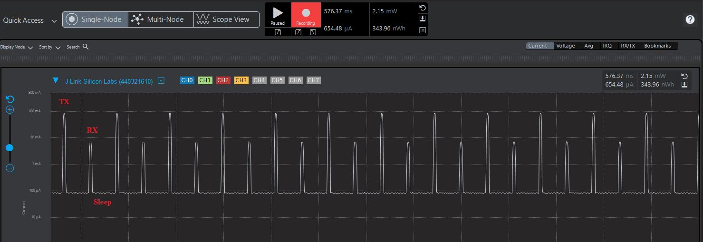

# Ping Pong Example

This example demonstrates a basic LoRa ping-pong communication between two devices using the Silicon Labs SiSDK.

## Overview

- **Ping Device:** Initiates communication by sending a "PING" message.
- **Pong Device:** Responds to "PING" messages with a "PONG" message.
- Communication uses LoRa modulation with configurable parameters.

## Features

- LoRaWAN public sync word
- Frequency: 868.1 MHz
- TX Power: 14 dBm
- Bandwidth: 250 kHz
- Spreading Factor: SF5
- Coding Rate: 4/5
- Preamble Length: 12
- Implicit header, CRC off, IQ not inverted

## How to Use

1. **Build the project** for your target hardware.
- If you use Simplicity Studio to create project, please follow build instruction in `project/README.md`
- If you use make to build example, run following command:

```bash
cd <path_to_your_local_repo>
make clean
make main_ping_pong
```
- Artifact will be located at `project/autogen/build/main_ping_pong` folder.
2. **Flash the firmware** to your device.
- You can use Simplicity Studio to flash firmware directly from your project in Simplicity Workspace or run following command to use example artifact in current repository (commander tool is required and need to be add to PATH):
```bash
cd <path_to_your_local_repo>
commander flash "project/autogen/build/main_ping_pong/main_ping_pong.s37" -s "$SERIAL"
```
3. **Connect two boards:**
- Flash the same firmware to both boards.
- On startup, the firmware will wait in an infinite loop until a button is pressed.
```
[D] INFO: Ping pong example Start ...
[D] INFO: Select button 0 or 1 to start ping pong:
  Button 0: Ping device
  Button 1: Pong device
```
- Press **BT0** on a board to select it as the Ping device (initiator).
```
[D] INFO: Ping pong example Start ...
[D] INFO: Select button 0 or 1 to start ping pong:
  Button 0: Ping device
  Button 1: Pong device
[D] INFO: Ping device selected
```
- Press **BT1** on a board to select it as the Pong device (responder).
```
[D] INFO: Ping pong example Start ...
[D] INFO: Select button 0 or 1 to start ping pong:
  Button 0: Ping device
  Button 1: Pong device
[D] INFO: Pong device selected
```
4. **Start the example:**
- After pressing the button a second time, communication will begin automatically.
5. **Observe output:**
- The Ping device sends "PING", the Pong device replies with "PONG".
- Status and received messages are printed via the debug console.
- Ping device:
```
[D] INFO: Ping pong example Start ...
[D] INFO: Select button 0 or 1 to start ping pong:
  Button 0: Ping device
  Button 1: Pong device
[D] INFO: Ping device selected
[D] INFO: TX Done!
[D] INFO: Received payload: PONG
[D] INFO: TX Done!
[D] INFO: Received payload: PONG
[D] INFO: TX Done!
[D] INFO: Received payload: PONG
[D] INFO: TX Done!
[D] INFO: Received payload: PONG
[D] INFO: TX Done!
[D] INFO: Received payload: PONG
[D] INFO: TX Done!
[D] INFO: Received payload: PONG
[D] INFO: TX Done!
[D] INFO: Received payload: PONG
[D] INFO: TX Done!
[D] INFO: Received payload: PONG
[D] INFO: TX Done!
```
- Pong device
```
[D] INFO: Ping pong example Start ...
[D] INFO: Select button 0 or 1 to start ping pong:
  Button 0: Ping device
  Button 1: Pong device
[D] INFO: Pong device selected
[D] INFO: Received payload: PING
[D] INFO: TX Done!
[D] INFO: Received payload: PING
[D] INFO: TX Done!
[D] INFO: Received payload: PING
[D] INFO: TX Done!
[D] INFO: Received payload: PING
[D] INFO: TX Done!
[D] INFO: Received payload: PING
[D] INFO: TX Done!
[D] INFO: Received payload: PING
[D] INFO: TX Done!
[D] INFO: Received payload: PING
[D] INFO: TX Done!
[D] INFO: Received payload: PING
[D] INFO: TX Done!
[D] INFO: Received payload: PING
[D] INFO: TX Done!
```
## Requirements

- Silicon Labs WSTK BRD4002A * 2.
- Silicon Labs EFR32xG28 * 2.
- Semtech SX1262 Evaluation Board * 2.
- Silicon Labs SiSDK.
- Simplicity Commander tool

## Power Management

This ping pong example is designed to support low power operation on Silicon Labs EFR32 platforms. The firmware leverages radio sleep modes and MCU sleep states to minimize energy consumption between transmissions and receptions.

### Low Power Features
- Radio enters sleep mode after each TX/RX event
- MCU uses EM2 sleep mode when idle
- Example can be used to measure current consumption during TX, RX, and sleep

### Measuring Power
To evaluate power consumption, connect the board to Energy Profiler. Observe the current profile during:
- TX event (sending PING/PONG)
- RX event (receiving PING/PONG)
- Sleep mode (between events)

> **Note:** After flashing the firmware, the kit must be reset to achieve real low power operation. This ensures the MCU and radio enter their proper sleep states.

#### TX/RX Power Profile


Average power consumption:
- Sleep: 85 μA
- TX: 85 mA
- RX: 8 mA

## Troubleshooting

- Ensure both devices are flashed with the correct firmware.
- Check serial numbers and device connections when flashing.
- Use the debug console for status and error messages.
