# User Guide: LoRaWAN EFR32FG28 Reference Design

**KEY FEATURES**

- Simplicity Studio v5 (SS5)

- Simplicity SDK v2025.6.0

- EFR32ZG28B322F1024IM68

- Semtech SX1262

This project is a Proof of Concept (PoC) aimed at porting and enabling the LoRa Basic Modem on the Silicon Labs EFR32FG28 microcontroller platform, utilizing Semtech SX1262/LLCC68 radio transceivers. The primary objective is to demonstrate stack integration and functionality through sample applications, facilitating the evaluation of low-power, long-range wireless communication capabilities for embedded systems.

**Table of Contents**

[1. Prerequisite](#1-prerequisite)

[1.1. Hardware setup](#11-hardware-setup)

[1.1.1	End Device Setup](#end-device-setup)

[1.1.2	Gateway Setup](#gateway-setup)

[1.2. Software setup](#12-software-setup)

[1.2.1 Windows/Ubuntu (Simplicity Studio 5)](#121-windowsubuntu-simplicity-studio-5)

[1.2.2 Ubuntu (CLI)](#122-ubuntu-cli)

[1.2.3 ChirpStack Network Server](#123-chirpstack-network-server)

[2. Firmware Usage Instructions](#2-firmware-usage-instructions)

[2.1. LoRaWAN Main Porting Test Example](#21-lorawan-main-porting-test-example)

[2.2. LoRaWAN Main Ping Pong Test Example](#22-lorawan-main-ping-pong-test-example)

[2.3. LoRaWAN Periodical Uplink Example](#23-lorawan-periodical-uplink-example)

[2.4. LoRaWAN Main LCTT Certification Example](#24-lorawan-main-lctt-certification-example)

[2.5 Firmware Update Over The Air](#25-firmware-update-over-the-air)

[2.5.1 Create Firmware for FUOTA](#251-create-firmware-for-fuota)

[2.5.2 Create FUOTA Deployment](#252-create-fuota-deployment)

[2.5.3 Flash Bootloader](#253-flash-bootloader)

[2.5.4 FUOTA Process](#254-fuota-process)

# 1. Prerequisite

Clone the LoRaWAN extension.

*git clone --recurse-submodules git@github.com:SiliconLabsSoftware/devs-refd-lorawan.git*

**Option 1: Using Simplicity Studio 5**

- Download and install [Simplicity Studio 5](https://www.silabs.com/software-and-tools/simplicity-studio/simplicity-studio-version-5).

**Option 2: Using Makefile**

- Download and install [Python3 3.13.3](https://www.python.org/downloads/) and [Commander](https://www.silabs.com/software-and-tools/simplicity-studio/simplicity-commander?tab=getting-started).

## 1.1. Hardware setup

Hardware requirements:

1. 2x EFR32xG28 development boards BRD4400C.
2. 2x Si-MB4002A Wireless Pro Kit Mainboard.
3. 2x BRD8042A Adapter Board.
4. 2x Semtech SX1262 LoRa module.
5. LPS8N LoRaWAN Gateway.
6. PC/Laptop for ChirpStack server.
7. PC/Laptop runs Windows 23H2 or Ubuntu 22.04.

### **End Device Setup**

Connect the BRD8042A Adapter Board to the Semtech SX1262 module. Then, connect the xG28 development kit to the BRD8042A Adapter Board.

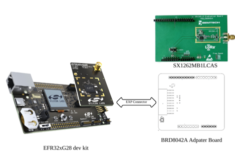

*Hardware setup block diagram*

### **Gateway Setup**

Set up the gateway by following the [LPS8N User Manual](https://wiki.dragino.com/xwiki/bin/view/Main/User%20Manual%20for%20All%20Gateway%20models/LPS8N%20-%20LoRaWAN%20Gateway%20User%20Manual/) through the end of [section 6.7](https://wiki.dragino.com/xwiki/bin/view/Main/User%20Manual%20for%20All%20Gateway%20models/LPS8N%20-%20LoRaWAN%20Gateway%20User%20Manual/). Since ChirpStack is used as the LoRaWAN network server, you may skip sections 4.1 to 4.3.

## 1.2. Software setup

### **1.2.1 Windows/Ubuntu (Simplicity Studio 5)**

#### **Install Simplicity SDK**

1. Navigate to the **Install** section in the menu.

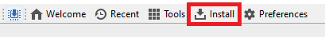

2. Select **Manage Installed Packages**.

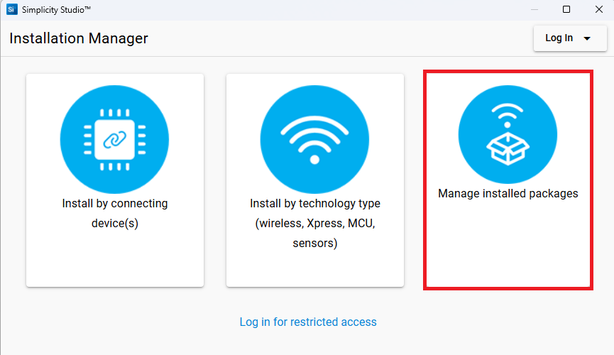

3. In the **SDK** tab, locate **Simplicity SDK** and click **Add** to install Simplicity SDK v2025.6.0.

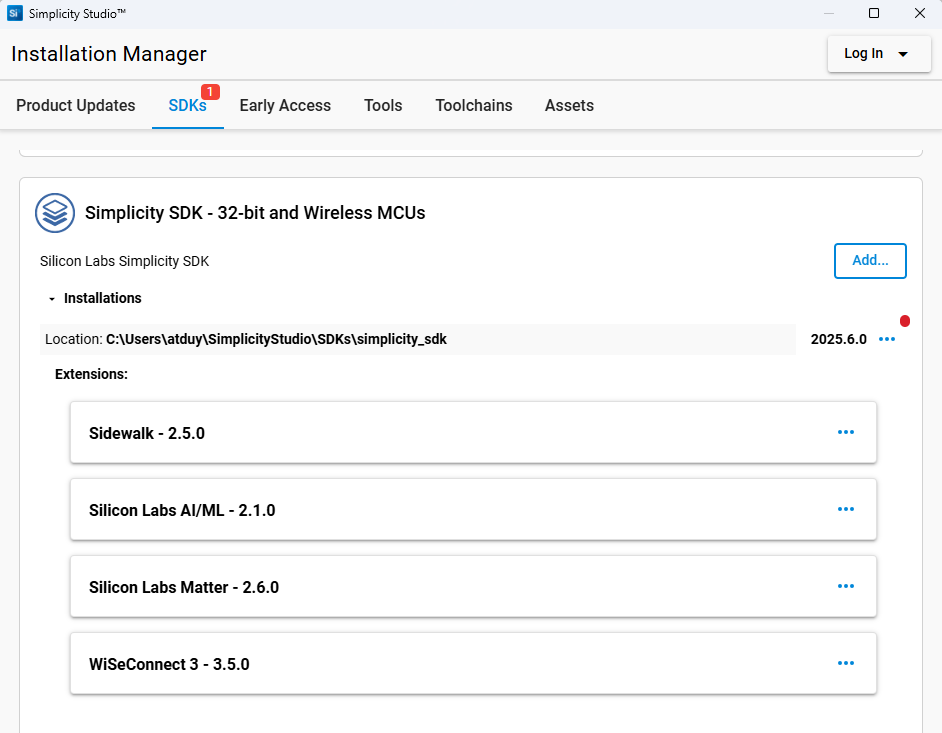

#### **Import LoRaWAN Extension**

1. Open **Preferences** from the Simplicity toolbar.

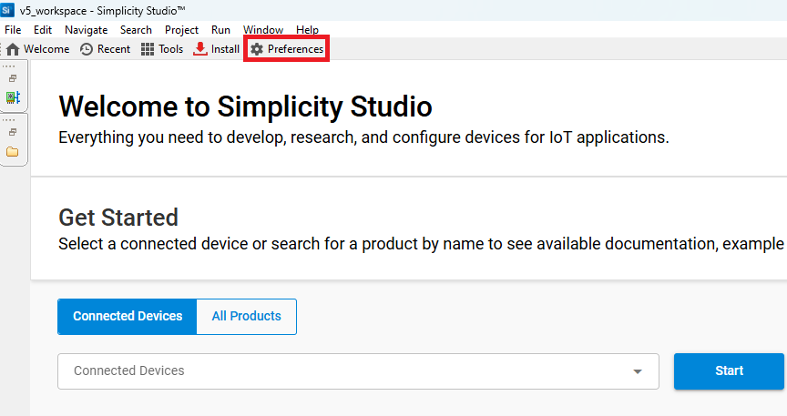

2. Filter by **SDK**, select SDK v2025.6.0, and choose **Add Extensions…**.

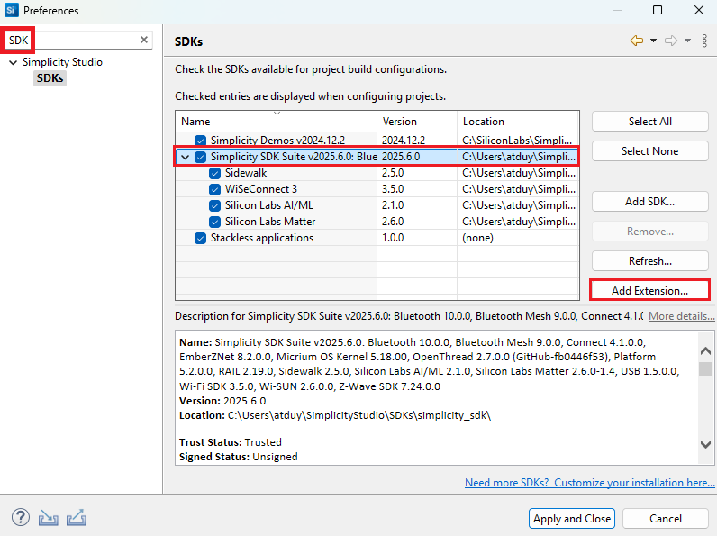

3. In the **Add SDK Extensions** window, click **Browse…** and select the project/lorawan_extension folder from your cloned project directory. Click **OK**.

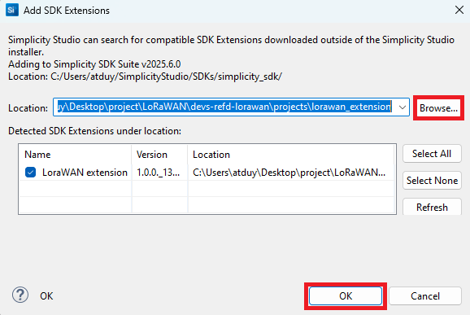

4. **Trust** the SDK extension.

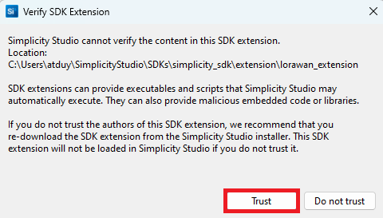

5. The **LoRaWAN Extension** will appear under SDK. Select **Apply and Close**.

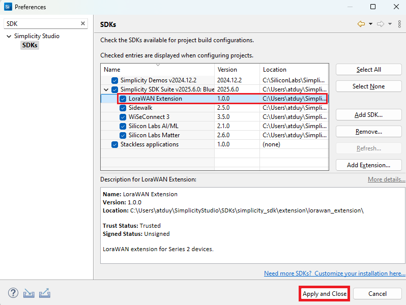

6. Connect the end device hardware to your PC. The connected board will be shown in the Launcher tab. Select Create New Project.

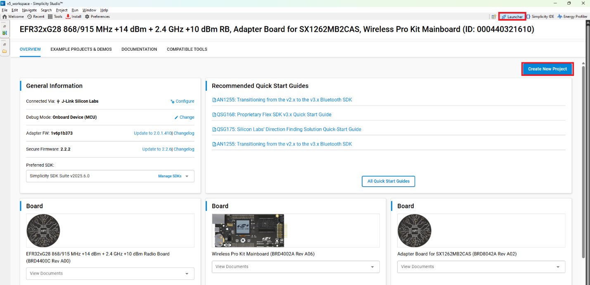

7. Filter by the keyword **lora** to view all available LoRaWAN example projects.

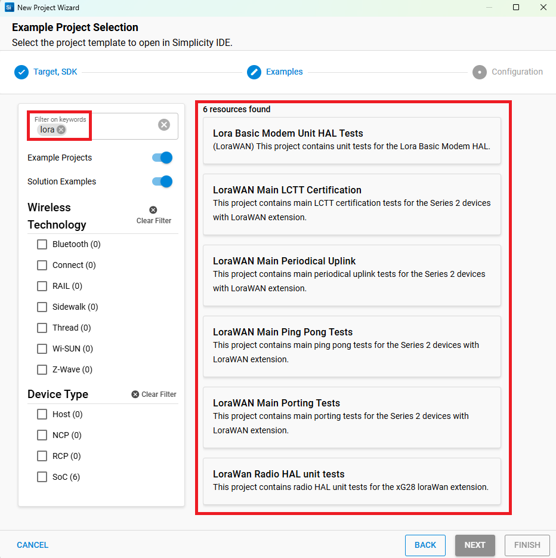

#### **Create and flash examples**

1. Select the desired example project and click **Next**.
2. Click **Finish** to create the project.

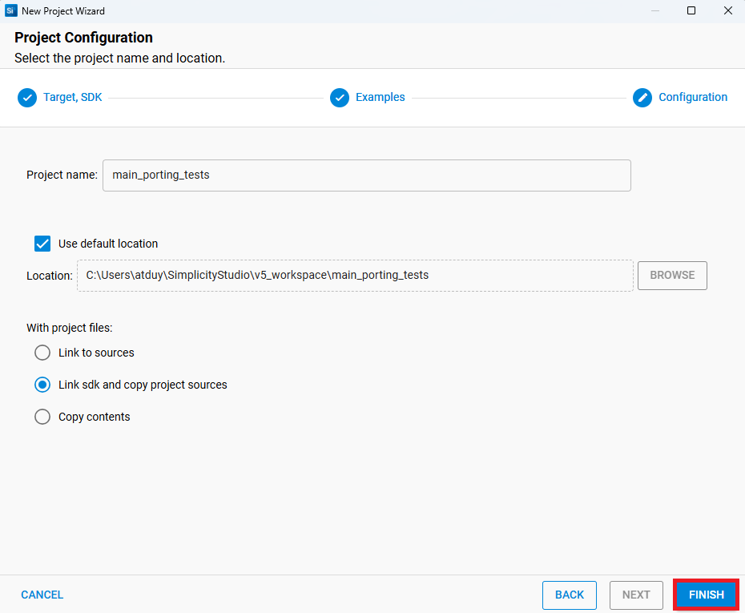

3. The project will appear in the **Project Explorer** tab.

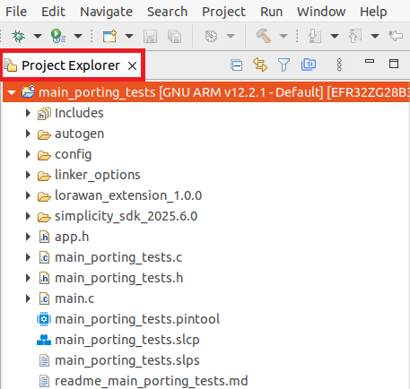

4. Right-click the project name and select **Build Project**.

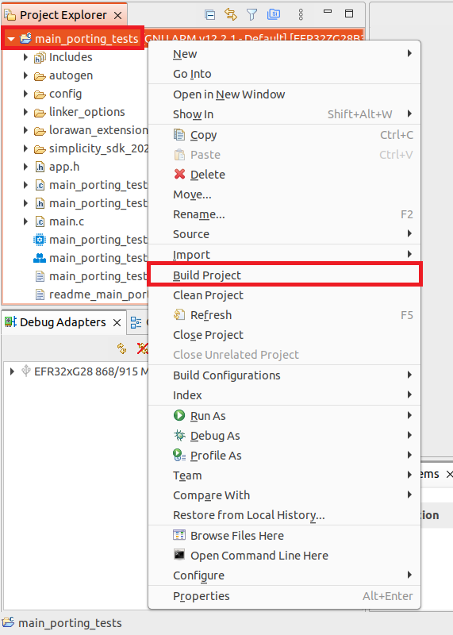

5. After a successful build, a **Binary** folder will appear. Right-click the .s37 file and select **Flash To Device…**.

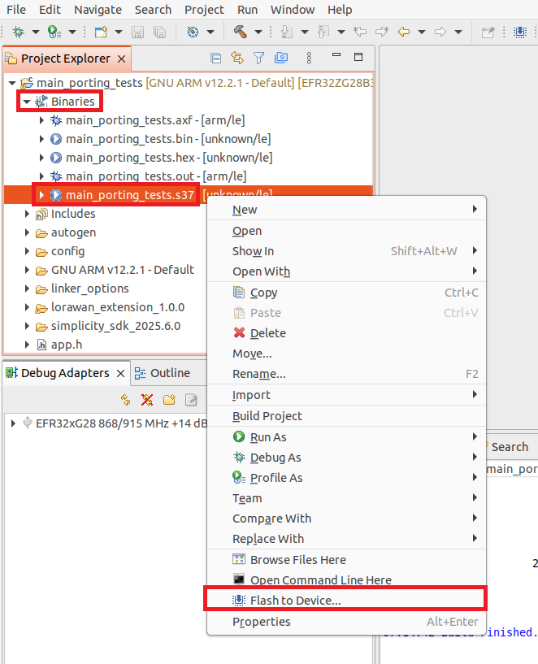

6. In the **Flash Programmer** window, click **Program** to flash the firmware to the board.

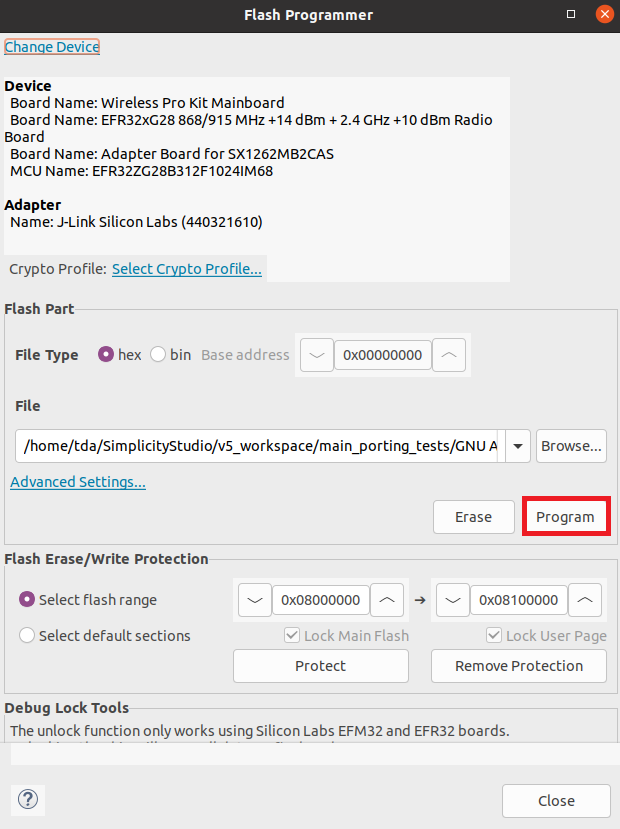

#### **Open console window**

1. The **Debug Adapter** tab will list all connected devices. Right-click the XG28 board and select **Launch Console…**.

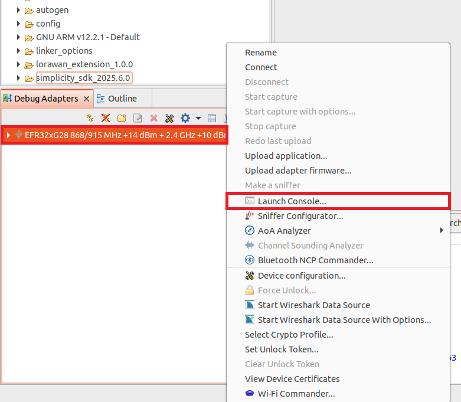

2. The console window will open. Select **Serial 1** to view logs from the device.

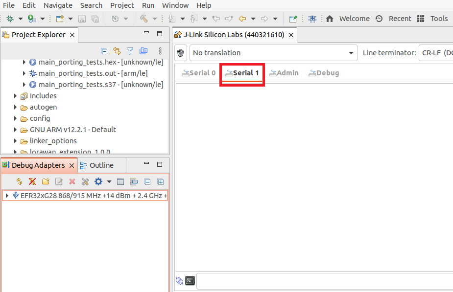

### **1.2.2 Ubuntu (CLI)**

#### **Install necessary packages**

1. Update all packages:

*sudo apt update && sudo apt upgrade -y*

2. Install the ARM toolchain:

*wget *[*https://developer.arm.com/-/media/Files/downloads/gnu/12.2.rel1/binrel/arm-gnu-toolchain-12.2.rel1-x86_64-arm-none-eabi.tar.xz*](https://developer.arm.com/-/media/Files/downloads/gnu/12.2.rel1/binrel/arm-gnu-toolchain-12.2.rel1-x86_64-arm-none-eabi.tar.xz)

*tar -xf arm-gnu-toolchain-12.2.rel1-x86_64-arm-none-eabi.tar.xz*

*sudo mv arm-gnu-toolchain-12.2.rel1-x86_64-arm-none-eabi /opt/*

*echo 'export PATH=/opt/arm-gnu-toolchain-12.2.rel1-x86_64-arm-none-eabi/bin:$PATH' >> ~/.bashrc*

*source ~/.bashrc*

*exec bash*

3. Re-open the terminal and verify the toolchain installation:

*arm-none-eabi-gcc --version*

4. Install Silabs Commander CLI:

*wget --content-disposition "https://www.silabs.com/documents/login/software/SimplicityCommander-Linux.zip"*

*unzip SimplicityCommander-Linux.zip -d commander-cli*

5. Extract the file that matches the system architecture (Example: x86_x64):

*tar -xvf commander-cli/SimplicityCommander-Linux/Commander-cli_linux_x86_64_1v20p5b1945.tar.bz*

#### **Build firmware**

1. Navigate to the projects/lorawan_extension/components/lbm_applications/4_porting_efr32 directory.
2. Build the firmware using:

*make sx1262 MODEM_APP="application_name"*

application_name:

- PERIODICAL_UPLINK
- PING_PONG
- PORTING_TESTS
- LCTT_CERTIF

Note: Run *make help* for more information on building options.

3. After a successful build, the firmware "app_sx1262.hex" will be located in projects/lorawan_extension/components/lbm_applications/4_porting_efr32/build_sx1262_brd4400c/.

#### **Flash firmware**

- Navigate to the Silabs Commander CLI folder in previous step and flash the firmware to the board:

*commander-cli flash <path_to_firmware> -d EFR32ZG28B322F1024IM68*

### **1.2.3 ChirpStack Network Server**

1. Follow the [LPS8N Guide for ChirpStack](https://wiki.dragino.com/xwiki/bin/view/Main/Notes%20for%20ChirpStack/) to create Applications, Device Profiles, and Devices.
2. Create Device Profiles with the following configuration (name can be customized as needed).

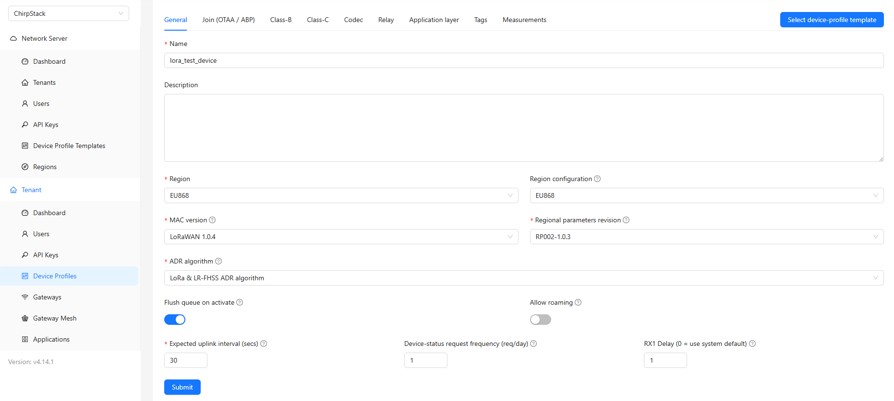

3. Enable Join(OTAA / ABP), Class-B, Class-C.
4. Configure the Application as shown below.

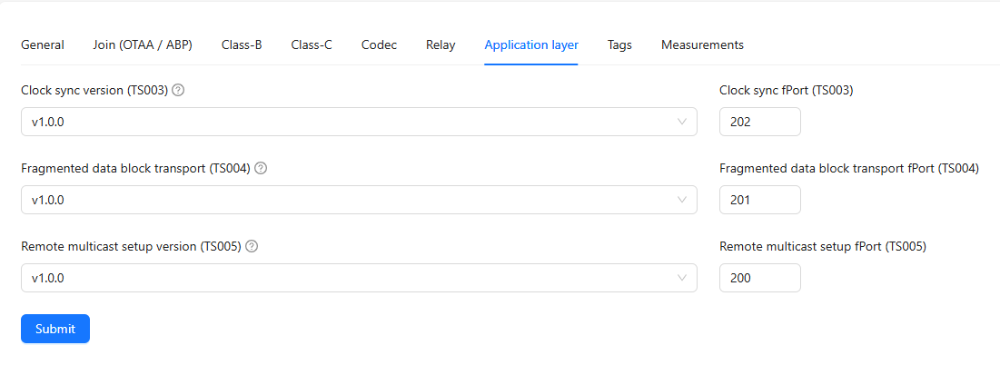

5. Example for EUI and key in [Step 5: Add device](https://wiki.dragino.com/xwiki/bin/view/Main/Notes%20for%20ChirpStack/).

Example:

- DeviceEUI: 		0000000000000001
- JoinEUI: 		0000000000000001
- Application key: 	00000000000000000000000000000001
- Gen App Key: 	00000000000000000000000000000001

# 2. Firmware Usage Instructions

For more detailed information, please refer to the README files located in each project within the projects/lorawan_extension/components/lbm_applications/4_porting_efr32/main_examples/ directory.

## 2.1. LoRaWAN Main Porting Test Example

This example provides a comprehensive test suite for verifying and validating the porting of the LoRaWAN Modem Hardware Abstraction Layer (HAL) on the Silicon Labs EFR32 platform. It evaluates the core functionality of the HAL to ensure that the porting has been implemented correctly.

Build and flash the firmware onto the board.

Upon successful execution, the console should display logs similar to the following:

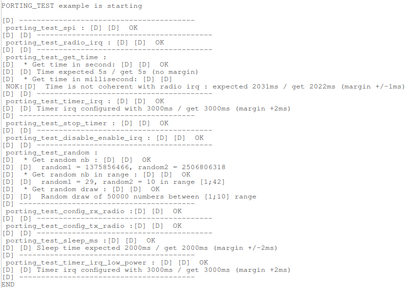

## 2.2. LoRaWAN Main Ping Pong Test Example

This example demonstrates basic LoRa ping-pong communication between two devices.

1. Flash two kits with the same ping-pong firmware.
2. After programming, each device will prompt the user to select the device type.

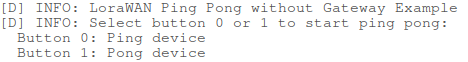

3. Press button 0 on one device and button 1 on the other device to assign their roles.
4. Press the same button again on each device to start the ping-pong process.
5. The devices will begin exchanging ping-pong messages.
6. Example log output from the Pong device:

 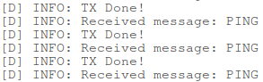

7. Example log output from the Ping device:

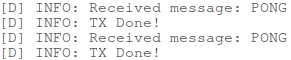

## 2.3. LoRaWAN Periodical Uplink Example

This example demonstrates a LoRaWAN end-device implementation that performs periodic uplink transmissions to the ChirpStack network server.

1. Obtain the device EUI and keys created from [this step](#123-chirpstack-network-server).
2. Open the example_options.h file and modify EUI and keys.

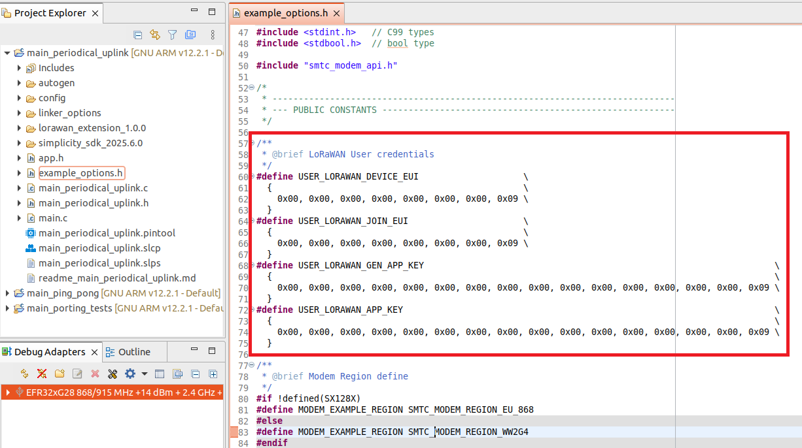

3. Rebuild the firmware and flash to the device.
4. The device will attempt to join the LoRaWAN network.

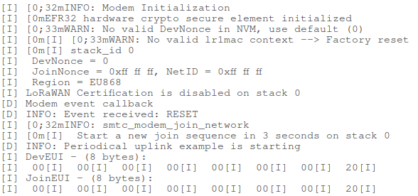

5. On successful network join, a confirmation log will be shown.

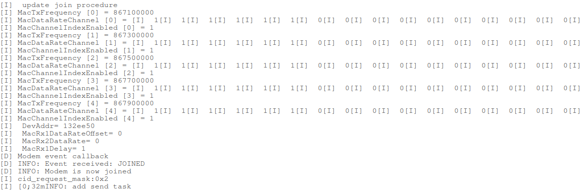

6. After joining the network, the device will periodically send data to the ChirpStack network server on port 101, incrementing the value by 1 with each transmission.

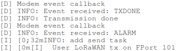

7. To manually send data on port 102, press button 0 on the device.

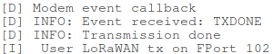

8. Data can be verified by logging into the ChirpStack Web UI and selecting the current application (e.g., lora_gateway).

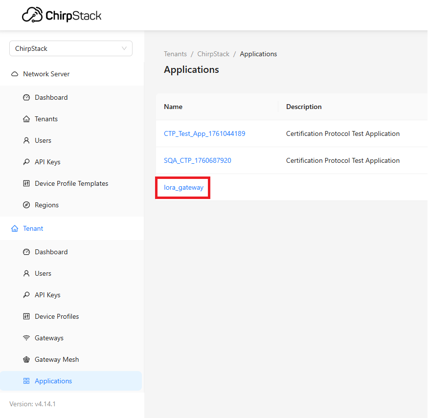

9. Select the corresponding DevEUI.

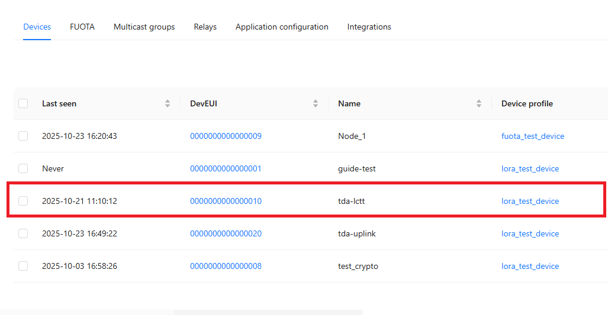

10. In the **Event** tab, you will find detailed information about each uplink, including the transmitted data.

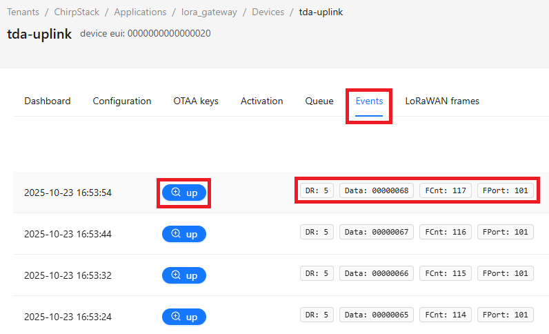

## 2.4. LoRaWAN Main LCTT Certification Example

This example demonstrates the usage of the LoRaWAN extension for LCTT (LoRaWAN Certification Test Tool) certification. It provides a reference implementation for running certification tests on Silicon Labs hardware using the LoRaWAN stack.

1. Follow steps a to d from [Main Uplink Example](#23-lorawan-periodical-uplink-example) to configure and flash the device.
2. Wait for the specified log message to appear, then press button 0 to start the certification example.

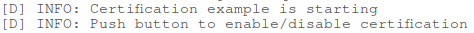

3. To manually send a MAC command, open the ChirpStack Web UI and navigate to Application/<your_application_name>/<your_device_name>/Queue. Set the FPort to 224.

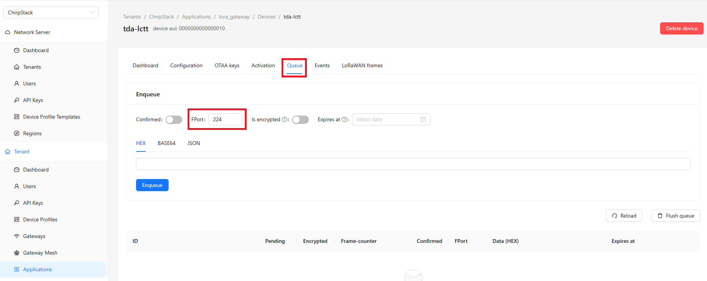

4. All supported LoRaWAN certification protocol commands are listed in section 5 of the [TS009 LoRaWAN Certification Protocol](https://resources.lora-alliance.org/technical-specifications/ts009-lorawan-certification-protocol-v1-0-0).
5. The ChirpStack server also supports sending commands via its API. To use the Python API, first install the ChirpStack API package:

*pip install chirpstack-api*

6. Generate an API key in the ChirpStack Web UI.

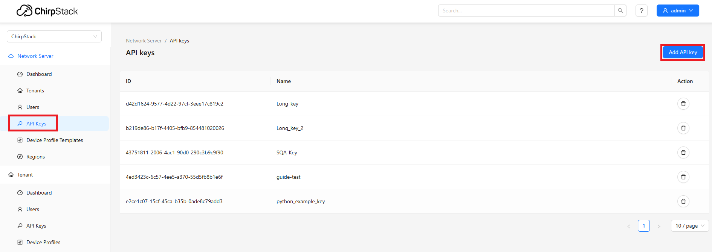

7. Create a Python script as shown below:

*import os*

*import sys*

*import grpc*

*from chirpstack_api import api*

*\# Configuration.*

*\# This must point to the API interface.*

*server = "<your_network_server_IP>:8080"*

*\# The DevEUI for which you want to enqueue the downlink.*

*dev_eui = "0101010101010101"*

*\# The API token (retrieved using the web-interface).*

*api_token = "..."*

*if **name** == "**main**":*

*  \# Connect without using TLS.*

*  channel = grpc.insecure_channel(server)*

*  \# Device-queue API client.*

*  client = api.DeviceServiceStub(channel)*

*  \# Define the API key meta-data.*

*  auth_token = \[("authorization", "Bearer %s" % api_token)\]*

*  \# Construct request.*

*  req = api.EnqueueDeviceQueueItemRequest()*

*  req.queue_item.confirmed = False*

*  req.queue_item.data = bytes(\[0xXX ...\]) \# MAC command and Payload (if needed)*

*  req.queue_item.dev_eui = dev_eui*

*  req.queue_item.f_port = 224*

*  resp = client.Enqueue(req, metadata=auth_token)*

*  \# Print the downlink id*

*  print(resp.id)*

8. Add the generated API key, and update the server, dev_eui, and req.queue_item.data fields.
9. Run the script with:

*py <file_name>.py*

10. Example: To send the PackageVersionReq command, send data 00.

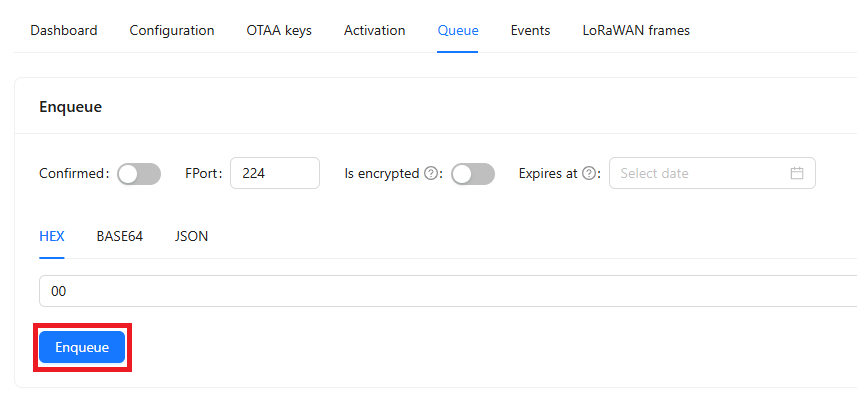

11. In the ChirpStack Web UI, open Applications/<your_application>/<your_device>/ in the Event tab. The device will respond to the ChirpStack server with the package version in the next uplink.

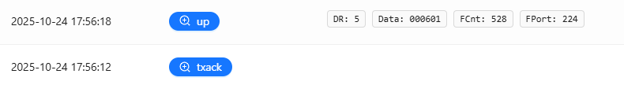

## 2.5 Firmware Update Over The Air

This demonstrates a LoRaWAN end-device implementation with FUOTA (Firmware Update Over The Air) capability, enabling remote firmware updates through the LoRaWAN network.

### **2.5.1 Create Firmware for FUOTA**

For the Silicon Labs MCU bootloader firmware upgrade feature, a .gbl file is required. A .gbl file can be created using the commander-cli tool with the following command:

*commander-cli gbl create <gbl-file-name>.gbl –app <application-file-name>.s37* (or .hex)

The .s37 file is available in the **Binary** folder after successfully building an example in Simplicity Studio 5. The **LoRa Basic Modem FUOTA** component needs to be installed as described in [**2.5.4 FUOTA Process**](#254-fuota-process).

For CLI, .hex file must be built with ALLOW_FUOTA option:

Example: *make sx1262 MODEM_APP=<application_name> ALLOW_FUOTA=yes*

To ensure successful conversion, the OTA application firmware must be built and flashed together with the bootloader.

### **2.5.2 Create FUOTA Deployment**

1. In the ChirpStack Web UI, navigate to Applications/<your_application_name>. Go to the **FUOTA** tab and select **New FUOTA Deployment**.

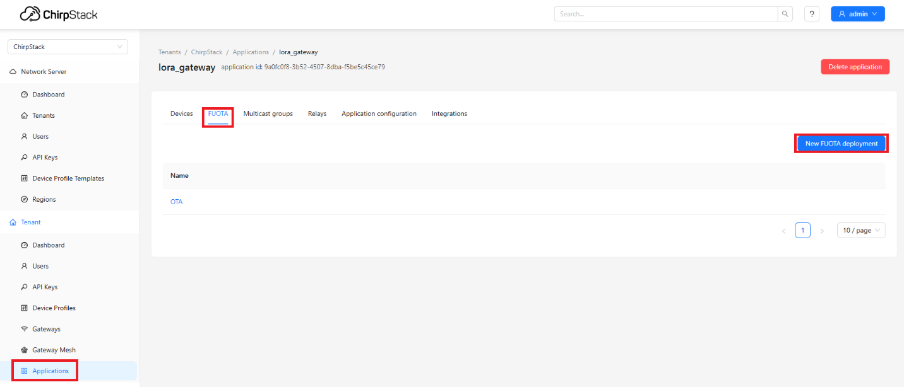

2. Configure the **Deployment** settings. For **Payload**, select the OTA firmware created in the [previous step](#251-create-firmware-for-fuota).

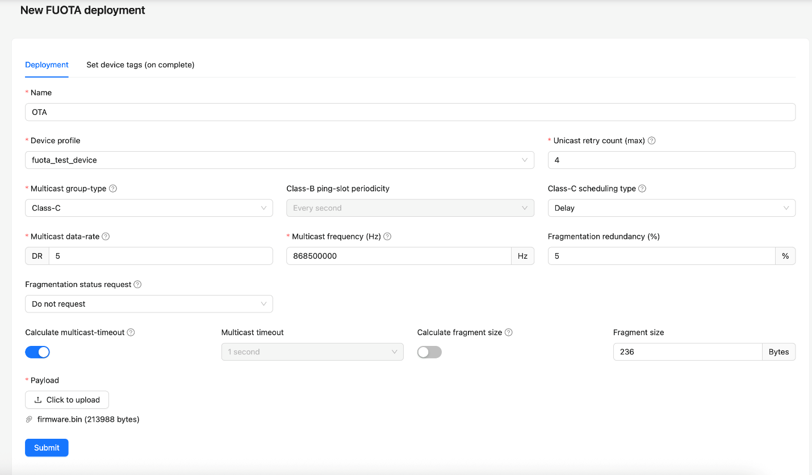

### **2.5.3 Flash Bootloader**

1. Create a bootloader example project in Simplicity Studio 5.

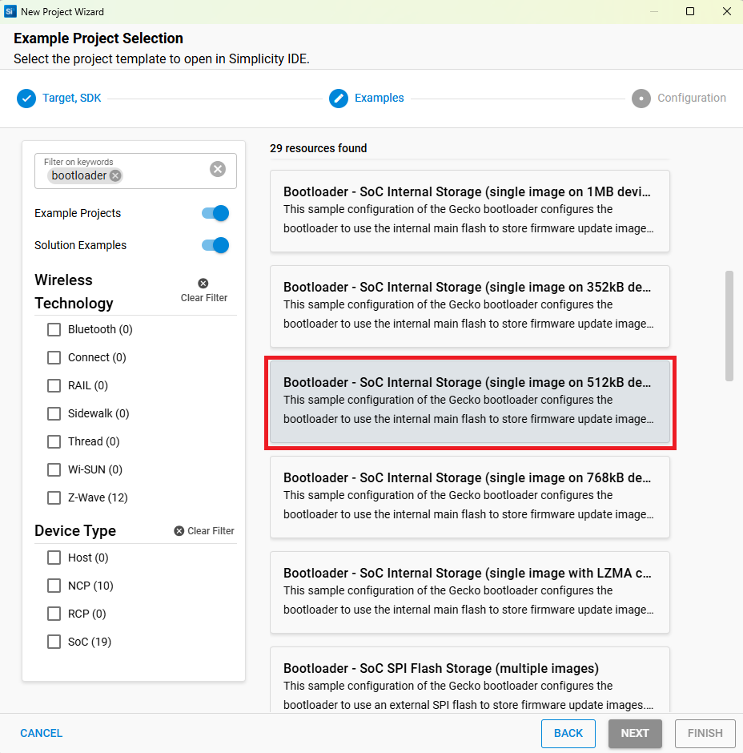

2. Open the .slcp file in the project. Filter the installed components using the keyword **bootloader storage**, locate **Bootloader Storage Slot Setup**, and select **Configure**.

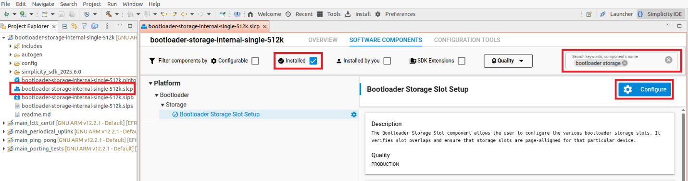

3. Set the **Slot Size** to 0x40000.

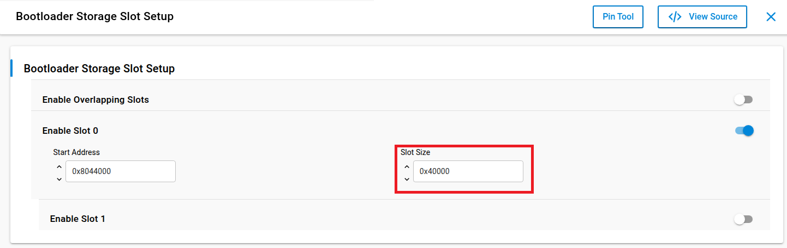

4. Build the project and flash the bootloader to the board.

### **2.5.4 FUOTA Process**

1. In the desired example project, open its .slcp file.
2. Uncheck **Production Ready**, then filter for "fuota" and install the **LoRa Basic Modem FUOTA Support** component.

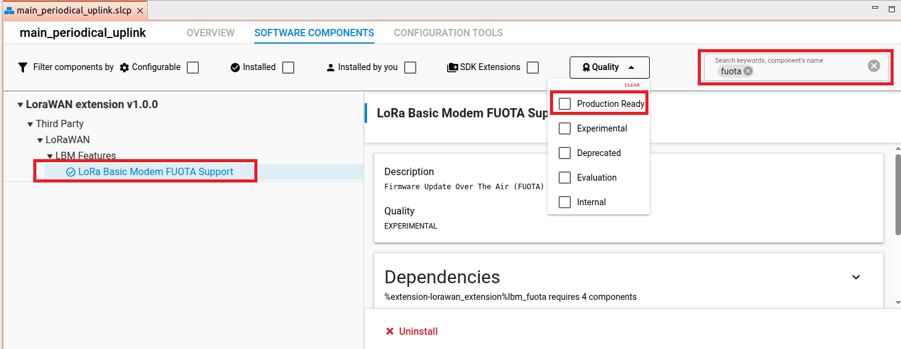

3. If building from the command line, add the ALLOW_FUOTA option to the make command.

Example: *make sx1262 MODEM_APP=PERIODICAL_UPLINK ALLOW_FUOTA=yes*

4. Rebuild the project and flash the firmware to the end device.
5. In the ChirpStack Web UI, go to **Gateways**, verify the gateway is selected for FUOTA, click **Selected gateways**, and choose **Add to FUOTA deployment**.

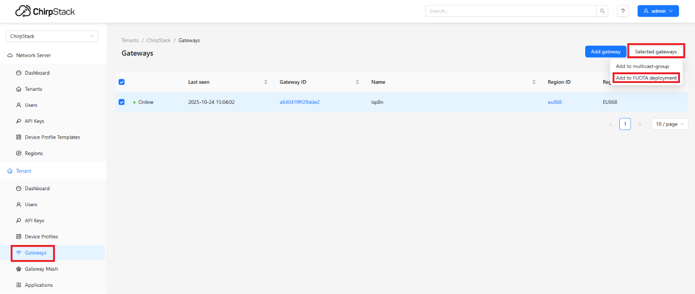

6. In Applications/<your_application_name>, select all devices for FUOTA, click **Selected devices**, and choose **Add to FUOTA deployment**.

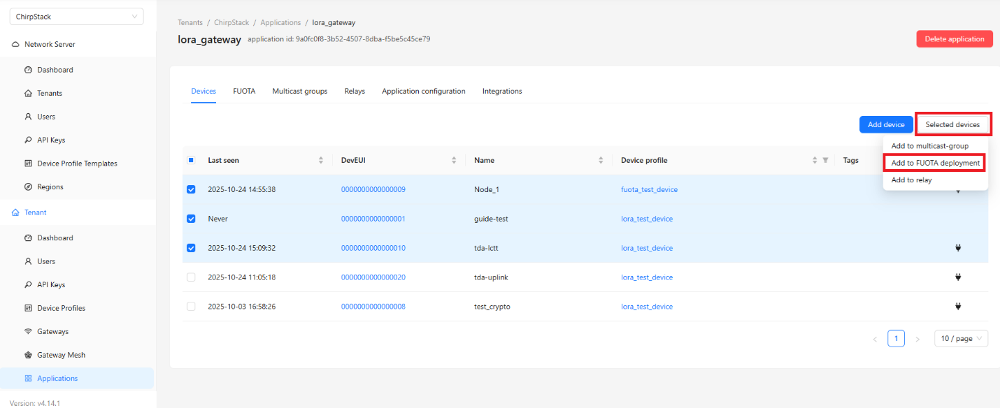

7. Select FUOTA deployment.

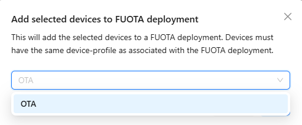

8. Go to the **FUOTA** tab, select the recently added FUOTA deployment, and click **Start deployment**.

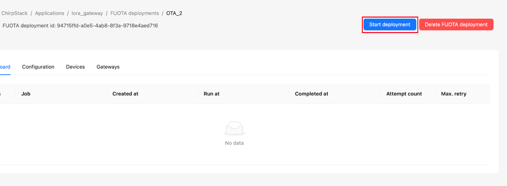

9. Deployment process can be monitored on the dashboard.

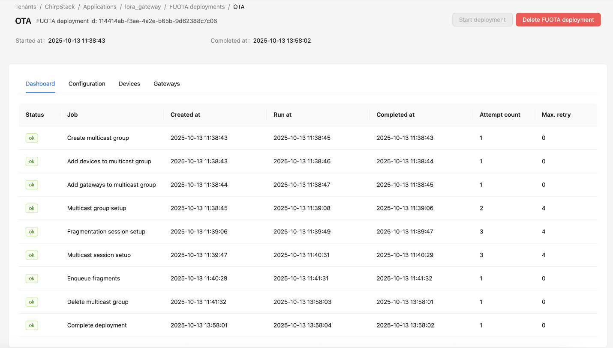
